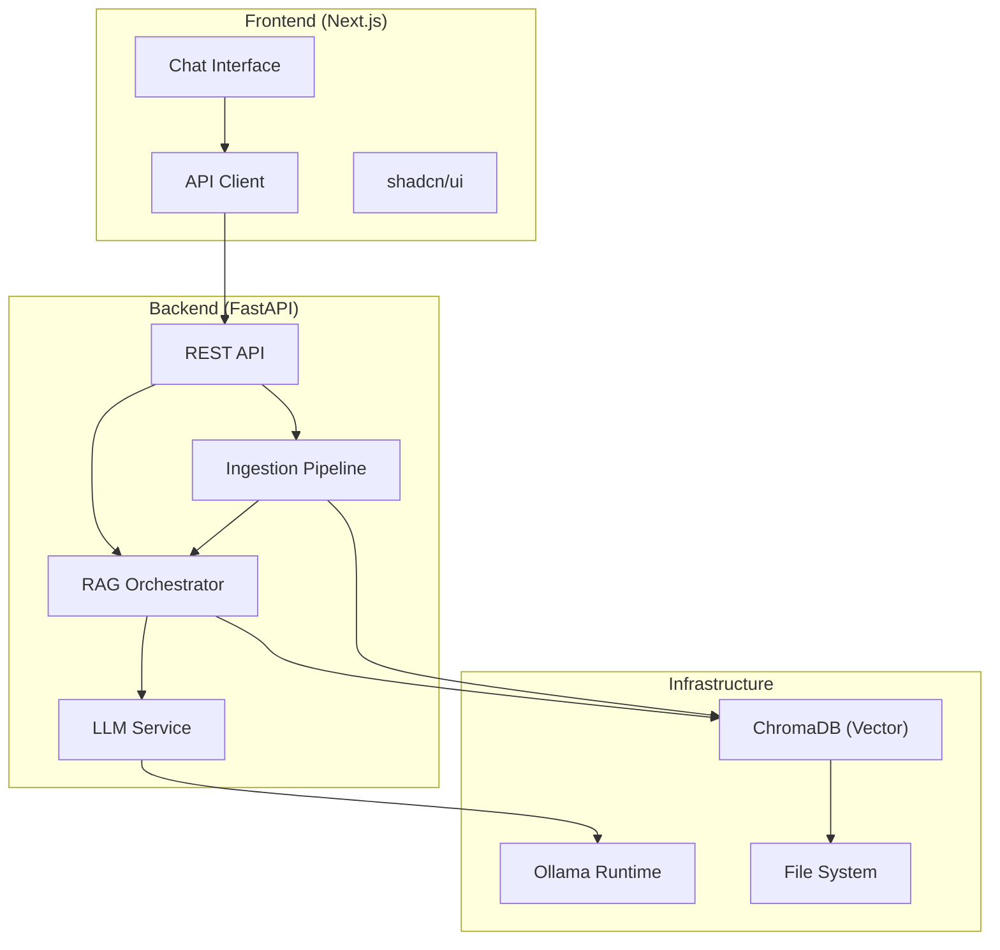

# Atlas-AI Architecture

Atlas-AI is a local-first, privacy-focused AI assistant that runs entirely on your device. It leverages open-source LLMs via Ollama, uses ChromaDB for vector storage and RAG, and provides a modern web interface.

## System Components



## Data Flow

1. **Chat (No Context)**:
   - User sends message → Frontend API Client → Backend `/api/chat`
   - Backend calls `LLMService` → Ollama generates response (streamed)
   - Tokens stream back to Frontend via SSE

2. **Ingestion**:
   - User uploads PDF/TXT → Frontend `/api/documents/upload`
   - Backend saves file → `IngestionService` loads & splits text
   - `EmbeddingService` generates vectors via Ollama
   - Vectors + Metadata stored in ChromaDB

3. **RAG Chat**:
   - User sends message → Backend queries `VectorStoreService`
   - ChromaDB returns top-k relevant chunks (similarity search)
   - Prompt augmented with context: *"Answer using these sources..."*
   - LLM generates response citing sources

## Technology Stack

- **Frontend**: Next.js 14, React 19, Tailwind CSS v4, shadcn/ui, TypeScript
- **Backend**: Python 3.12+, FastAPI, LangChain, Pydantic
- **AI Runtime**: Ollama (manages Llama 3.2, etc.)
- **Database**: ChromaDB (local persistent vector store)

## Directory Structure

```
atlas-ai/
├── atlas-engine/           # Python Backend
│   ├── app/
│   │   ├── api/            # API Routes
│   │   ├── services/       # Business Logic (LLM, RAG, DB)
│   │   ├── config.py       # Settings
│   │   └── main.py         # App Entry Point
│   ├── data/               # Persistent Data (ChromaDB, Uploads)
│   └── requirements.txt
│
├── atlas-web/              # Next.js Frontend
│   ├── app/
│   │   ├── components/     # React Components
│   │   ├── lib/            # API Client & Utils
│   │   └── page.tsx        # Main Chat Interface
│   └── public/             # Static Assets
│
└── docs/                   # Documentation
```
